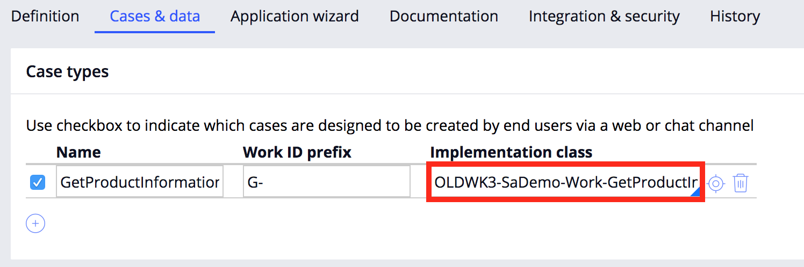

# Pega API Lambda Boilerplate

A simple Lambda function that calls the Pega Create Case API. For more information, you can access the Pega API help documentation from the Designer Studio Resources menu.

## Prerequisites
- An externally exposed Pega instance (Not a trial)
- Amazon developer account

## Usage
- First, you'll want to create a case in your Pega application. [Creating a Case in Pega](https://pdn.pega.com/creating-case "Creating a Case in Pega").
- Once you've created your case, you'll want to copy down the class name. This is found by navigating to the **Application Menu > Definition** from here, navigate to the **Cases and data** tab and copy the class from the implementation class.

- Once you've created your case in Pega, we'll want to set up our Lambda function in Amazon. Make sure to create a new function from scratch and select Node 6.1 as your runtime enviroment. For additional information on setting up your Lambda function, see [here](https://docs.aws.amazon.com/lambda/latest/dg/get-started-create-function.html "here").

- Once you've created you function, upload the archive.zip found in this repository. 
Show screenshot of upload area in Amazon dev portal

- Set your enviroment variables 

**CASE_PROP_PYLABEL** - This will set the pyLabel property of your case

**CASE_PROP_PYNOTE** - This will set the pyNote property of your case

**OPERATOR_ID** - The operator ID to authenticate the API call

**OPERATOR_PWD** - The operators password

**PEGA_API_ENDPOINT** - Enter the case class that you copied earlier

**SYS_URL** - The url of your Pega instance

If you'd like, you can encrypt your enviroment variables by following the documentation
[Encrypting Variables](https://docs.aws.amazon.com/lambda/latest/dg/env_variables.html#env_encrypt "Encrypting Variables")

