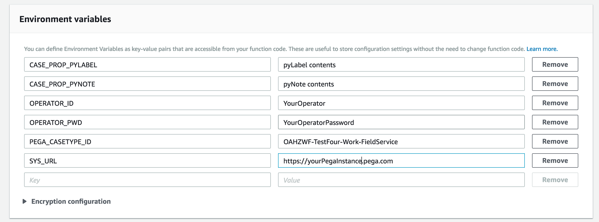

# Pega API Lambda Boilerplate

A simple Lambda function that calls the Pega "Create Case" API. For more information, you can access the Pega API help documentation from within **Designer Studio > Resources menu**.

## Prerequisites
- An externally exposed Pega instance (Not a trial)
- Amazon developer account

## Usage
- First, you'll want to [create a case in your Pega application](https://pdn.pega.com/creating-case "Creating a Case in Pega").
- Once you've created your case, you'll want to copy down the class name. This is found by navigating to the **Application Menu > Definition**. Then navigate to the **Cases and data** tab and copy the class from the implementation class:

- Once you've created your case in Pega, we'll want to set up our Lambda function in Amazon. Create a new function from scratch, select Node 6.1 as your runtime enviroment, and [choose a role with the permissions you need](https://docs.aws.amazon.com/IAM/latest/UserGuide/id_roles_create_for-service.html?icmpid=docs_iam_console). For additional information on setting up your Lambda function, see [here](https://docs.aws.amazon.com/lambda/latest/dg/get-started-create-function.html "here").

- Once you've created your function, upload the archive.zip found in this repository under **Function package**: 

- Set your enviroment variables 

**CASE_PROP_PYLABEL** - This will set the pyLabel property of your case

**CASE_PROP_PYNOTE** - This will set the pyNote property of your case

**OPERATOR_ID** - The operator ID to authenticate the API call

**OPERATOR_PWD** - The operators password

**PEGA_API_ENDPOINT** - Enter the case class that you copied earlier

**SYS_URL** - The url of your Pega instance

When you're done, your environment variables should look like the following: 

If you'd like, you can encrypt your enviroment variables by following the [documentation on Amazon](https://docs.aws.amazon.com/lambda/latest/dg/env_variables.html#env_encrypt "Encrypting Variables").

## Testing

Finally, to confirm that you've configured your function properly, you'll want to run a test. In your Lambda function editor, go to **_Select a test event..._ > Configure test events > Create new test event**:

Then choose an event template based on what you plan to trigger this Lambda, such as an S3 Put. Save this test. Now you can click **Test** to trigger a test of your Lambda.
