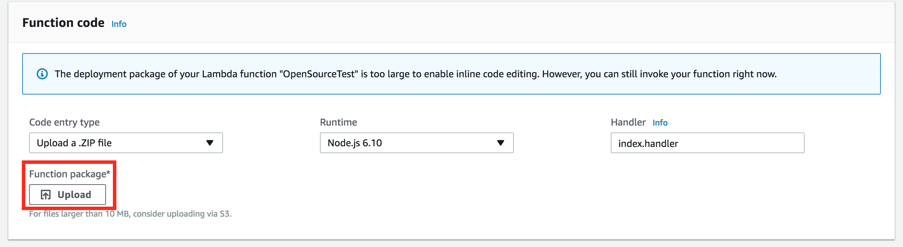

# Pega API Lambda Boilerplate

A simple Lambda function that calls the Pega Create Case API. For more information, you can access the Pega API help documentation from the Designer Studio Resources menu.

## Prerequisites
- An externally exposed Pega instance (Not a trial)
- Amazon developer account

## Usage

### Configure a case in Pega
- First, you'll want to create a case in your Pega application. [Creating a Case in Pega](https://pdn.pega.com/creating-case "Creating a Case in Pega").
- Once you've created your case, you'll want to copy down the class name. This is found by navigating to the **Application Menu > Definition** from here, navigate to the **cases and data** tab and copy the class from the implementation class.

### Configure Lambda function
Once you've created your case in Pega, we'll want to set up our Lambda function in Amazon. Make sure to create a new function from scratch and use the following settings:

- **Name** create a name for your Lambda functon

- **Runtime** - Node.js 6.10.

- **Role**  - Choose an existing role.

- **Existing role**, choose lambda_basic_execution.

Click the **"Create Function"** button.

For additional information on setting up your Lambda function, see [here](https://docs.aws.amazon.com/lambda/latest/dg/get-started-create-function.html "here").

### Upload your function
Once you've created your function, upload the archive.zip found in this repository to your Lambda function. To do this:

- Under Code entry type, select "Upload a .Zip File"

- Under Function package, click the upload button and select the .zip file included in this repository

### Set the enviroment variables for your function:
Create the following in the "Environment variables" section of your Lambda function. These will be passed into the function at runtime. 

- **CASE_PROP_PYLABEL** - This will set the pyLabel property of your case, you can set it to any string (You can edit the json that is sent to the Pega API in the index.js file to populate other case specific properties. pyLabel was just used as an example )

- **CASE_PROP_PYNOTE** - This will set the pyNote property of your case, you can set it to any string (You can edit the json that is sent to the Pega API in the index.js file to populate other case specific properties. pyNote was just used as an example )

- **OPERATOR_ID** - The operator ID to authenticate the API call

- **OPERATOR_PWD** - The operators password

- **PEGA_CASETYPE_ID** - Enter the case class that you copied earlier

- **SYS_URL** - The url of your Pega instance

When you're done, your environment variables should look like the following: 

If you'd like, you can encrypt your enviroment variables by following the documentation
[Encrypting Variables](https://docs.aws.amazon.com/lambda/latest/dg/env_variables.html#env_encrypt "Encrypting Variables")

### Test your function by invoking it manually
Finally, to confirm that you've configured your function properly, you'll want to run a test. In your Lambda function editor, go to **_Select a test event..._ > Configure test events > Create new test event**:

Then choose an event template based on what you plan to trigger this Lambda, such as an S3 Put. Save this test. Now you can click **Test** to trigger a test of your Lambda.
